# Vyapaar

[](https://github.com/JatinAvtani/RETAIL_OS/actions/workflows/ci.yml)
[](LICENSE)

Operations intelligence for food-service retail — cafés, bakeries, and restaurants.

Vyapaar reads POS sales and supplier prices, reconciles them against recipes and an append-only
stock ledger, and answers the question most small food businesses cannot answer:

> **Where did my margin actually go?**

The headline output is **cost variance** — the gap between what your recipes say you should have
consumed and what your stock ledger says you actually consumed. That gap is waste, over-portioning,
and shrinkage combined. It is invisible without *both* a recipe model and a movement ledger, which
is why almost no small business knows the number.

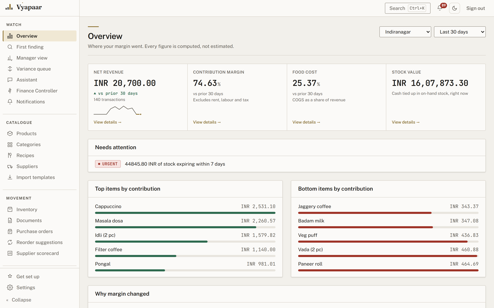

---

## What it found in the demo corpus

Running against the seeded three-outlet dataset, Vyapaar surfaced **₹6,50,694 of goods that were
invoiced but never delivered** — across 75 supplier invoices, in a business whose books balanced and
whose payments all cleared.

One supplier accounted for ₹2,51,760 of it, short-delivering on 37 of 40 invoice lines.

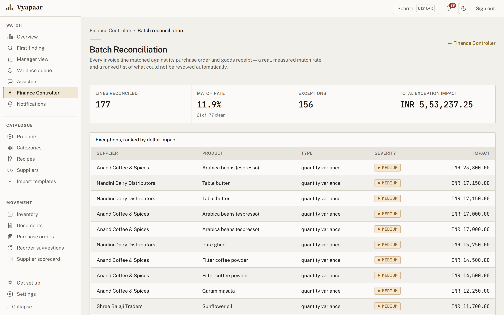

Nothing about this was visible in the accounting. Every invoice was internally consistent. The
discrepancy only exists between three documents that no small business systematically compares: the
purchase order, the goods receipt, and the invoice.

---

## Table of contents

- [Quick start](#quick-start) — get it running in ~10 minutes
- [Guided tour](#guided-tour) — what to look at, with screenshots
- [How it works](#how-it-works) — 10 architecture diagrams
- [The design principle](#the-design-principle-everything-follows)
- [Troubleshooting](#troubleshooting)
- [Testing](#testing) · [Demo data](#demo-data) · [Scope boundaries](#scope-boundaries)

---

## Quick start

### Prerequisites

| Requirement | Version | Check with |
|---|---|---|
| **Node.js** | **22 or later** (enforced by `engines`) | `node --version` |
| **pnpm** | 10.34.5 — installed automatically by `corepack enable` | `pnpm --version` |
| **Docker Desktop** | any current, running | `docker ps` |
| Disk space | ~3 GB | — |
| RAM | 8 GB minimum, 16 GB comfortable | — |

> **Getting pnpm.** `corepack enable` reads the `packageManager` field in `package.json` and
> provisions the exact pinned version. On **Windows it can fail with `EPERM`** unless the terminal
> is elevated — if that happens, either run the terminal as Administrator, or just install pnpm
> directly, which works fine:
>
> ```bash
> npm install -g pnpm@10.34.5
> ```

A Gemini API key is **optional**. Without one the seeded demo is fully explorable; live model calls
degrade to an explicit "unavailable" instead of fabricating an answer.

### Five commands

```bash
git clone https://github.com/JatinAvtani/RETAIL_OS.git
cd RETAIL_OS

cp .env.local.example .env.local   # works as-is; add GEMINI_API_KEY only for live AI
docker compose up -d               # Postgres, Redis, MinIO  (~30s to healthy)
corepack enable                    # see the note above if this errors on Windows
pnpm install --frozen-lockfile     # ~2 min
pnpm demo:quick                    # migrations + deterministic seed  (~10 min)
pnpm dev                           # web :3000 · api :3001 · worker
```

`.env.local.example` needs **no editing** — the database URLs, the Redis port and the MinIO
credentials in it already match `docker-compose.yml`.

Timings above were measured on a cold clone on a typical Windows laptop. Before `demo:quick`,
confirm the containers are actually up:

```bash
docker ps      # expect postgres, redis, minio — all healthy
```

Then open **<http://localhost:3000>** and either click **Explore with sample data**, or sign in:

```
demo@vyapaar.test
Vyapaar-Demo-Cafe-2026!
```

> **Set the store filter to Indiranagar** for the richest dataset. The figures quoted in this
> README come from that outlet.

### What `demo:quick` actually does

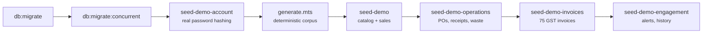
```mermaid
flowchart LR
  A["db:migrate"] --> B["db:migrate:concurrent"]
  B --> C["seed-demo-account<br/><small>real password hashing</small>"]
  C --> D["generate.mts<br/><small>deterministic corpus</small>"]
  D --> E["seed-demo<br/><small>catalog + sales</small>"]
  E --> F["seed-demo-operations<br/><small>POs, receipts, waste</small>"]
  F --> G["seed-demo-invoices<br/><small>75 GST invoices</small>"]
  G --> H["seed-demo-engagement<br/><small>alerts, history</small>"]
```

Every step writes through the **same repositories and services the application uses** — sales run
recipe explosion → FEFO draw → movement posting; invoices go through the real upload → confirm →
approve pipeline. Nothing is inserted directly into a results table.

`pnpm demo:quick` bounds sales to 14 days and ≤10 receipts per store-day (≤420 receipts) so review
doesn't need the multi-hour replay. `pnpm demo` runs the canonical 180-day, 42,875-transaction
corpus.

---

## Guided tour

Six screens, in the order that tells the story.

### 1 · The dashboard refuses to guess

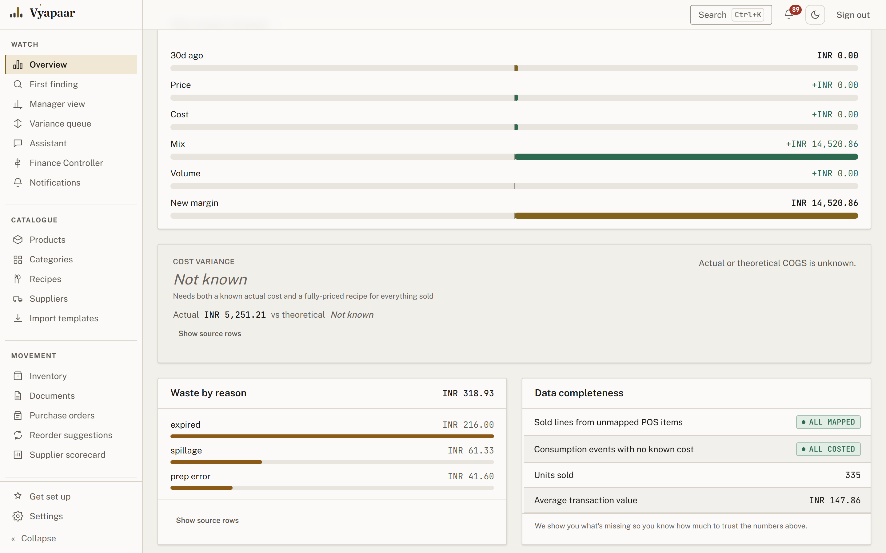

Cost variance reads **"Not known"** — and says exactly what's missing. One ingredient in the corpus
is deliberately left unpriced, so a real menu item cannot be fully costed.

Almost every tool in this category would print `0` here. A zero means *your costs match theory
perfectly* — it looks like good news, and it's a lie. Beside it, the **Data completeness** panel
reports how much of the input is actually present, so you know how far to trust the numbers above.

### 2 · Batch reconciliation — the finance-ops loop


Every invoice line matched against its purchase order and goods receipt. A measured match rate, and
every unresolved exception ranked by rupee impact.

The match rate is **whatever the data actually is**. A low rate means the corpus genuinely contains
discrepancies — that's the finding, not a defect. Raising it would mean inventing agreement between
invoices and deliveries, which is the exact failure this system exists to catch.

### 3 · Three-way match — the evidence

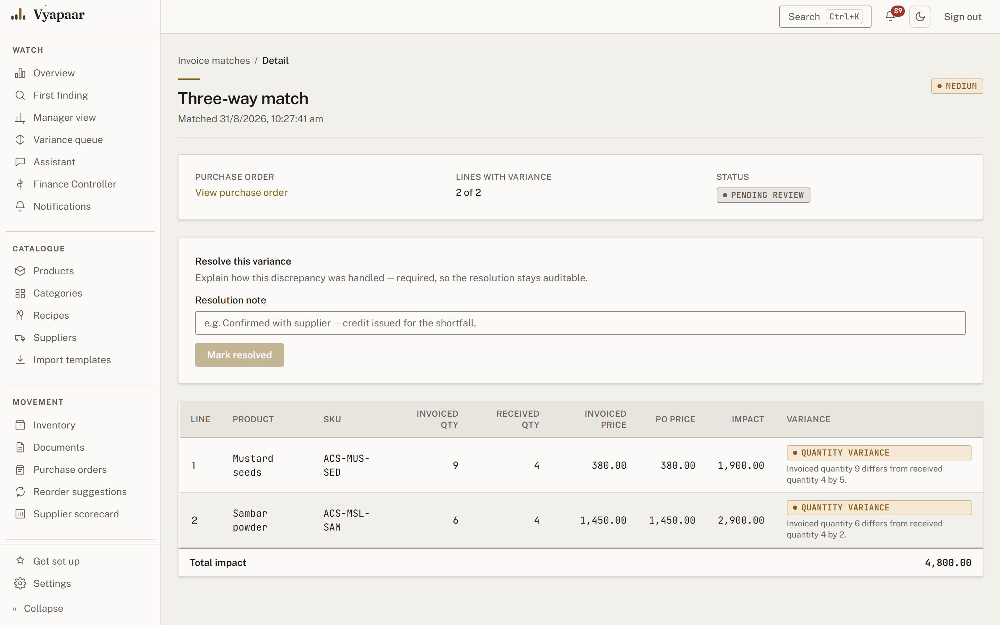

Invoiced 9, received 4, impact ₹1,900 — with a plain-English explanation per line. Closing a
variance **requires** a resolution note, so the outcome stays auditable months later.

### 4 · The Finance Controller investigates on its own

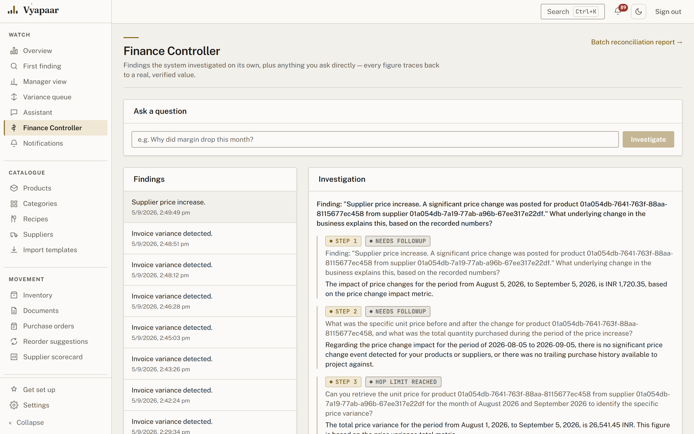

No question was typed. A scheduled sweep detected the finding, composed the question, and ran a
bounded multi-hop investigation. Each step shows its own verdict — `NEEDS FOLLOWUP`, `SUFFICIENT`,
or `HOP LIMIT REACHED` — and it never claims a conclusion it didn't reach.

### 5 · Ask in plain English, get cited numbers

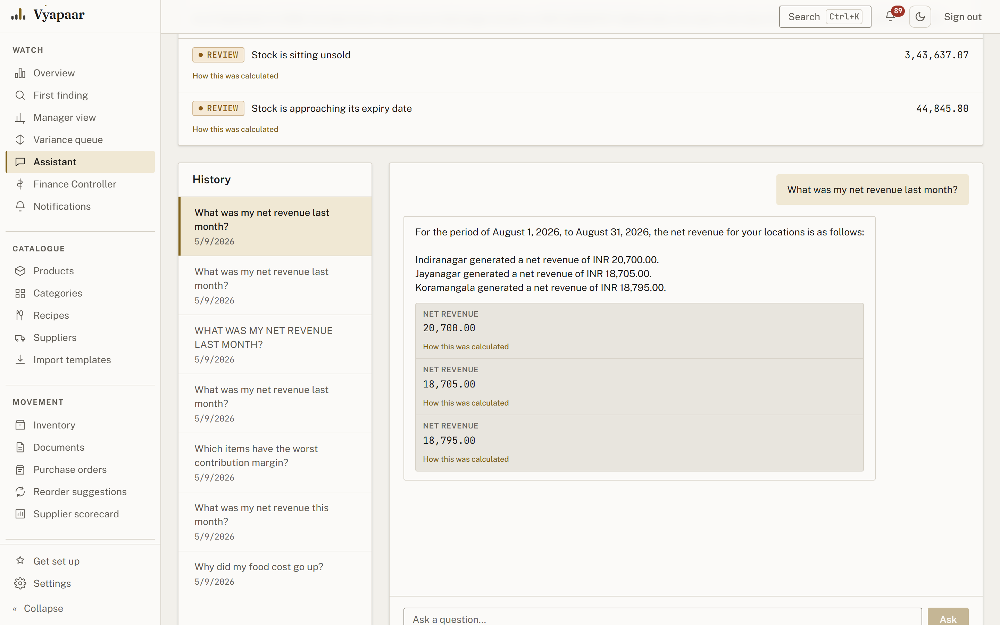

Every figure is a card with **"How this was calculated"**. The model chose *which* metric answers
the question; deterministic code computed it. If a narration contains a number that isn't backed by
a computed metric or quoted verbatim from a source document, it is regenerated once and then
discarded.

### 6 · Documents in, evidence preserved

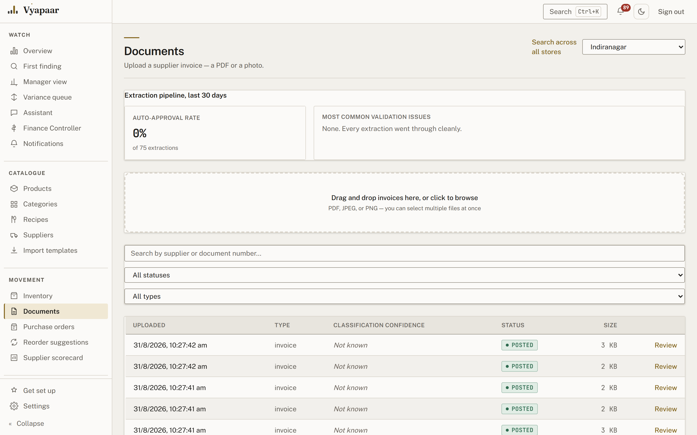

Drag in a PDF or a photo of a supplier invoice. Extraction, deterministic validation, and posting
stay connected in one drillable chain.

<details>
<summary><b>More screens</b> — variance queue, inventory, suppliers, assistant home</summary>

**Variance review queue** — mismatches worth checking, worst first
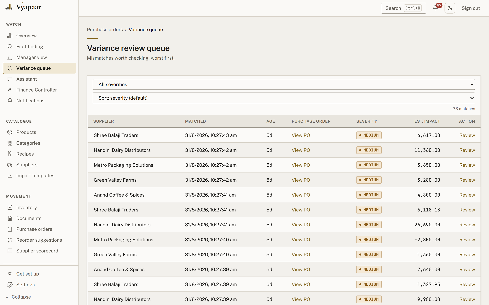

**Finance Controller** — findings feed and investigation panel
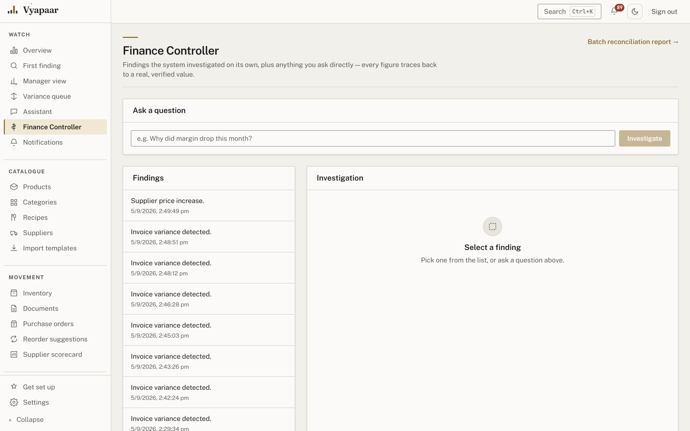

**Inventory** — stock as a projection of the ledger, never a stored counter
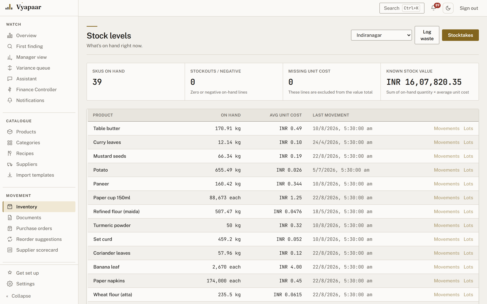

**Suppliers**
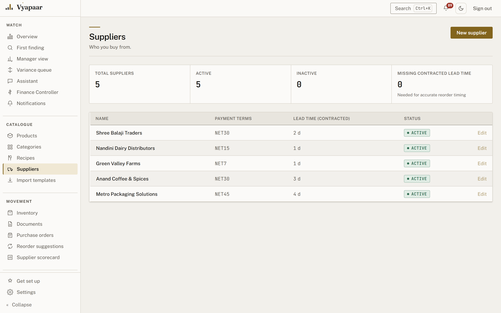

**Assistant** — daily briefing plus free-form questions
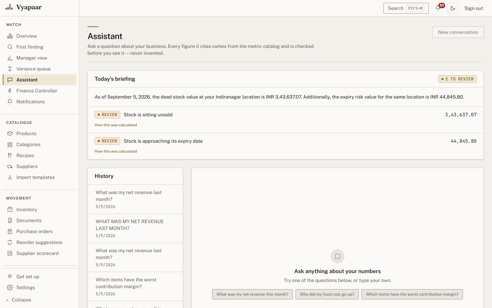

</details>

---

## How it works

### 1 · The chain every number travels

Break any link and the product cannot answer its headline question.

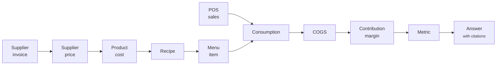
```mermaid
flowchart LR
  INV["Supplier<br/>invoice"] --> SP["Supplier<br/>price"]
  SP --> PC["Product<br/>cost"]
  PC --> R["Recipe"]
  R --> MI["Menu<br/>item"]
  POS["POS<br/>sales"] --> CONS["Consumption"]
  MI --> CONS
  CONS --> COGS["COGS"]
  COGS --> CM["Contribution<br/>margin"]
  CM --> M["Metric"]
  M --> ANS["Answer<br/><small>with citations</small>"]
```

### 2 · Three processes, split by resource profile

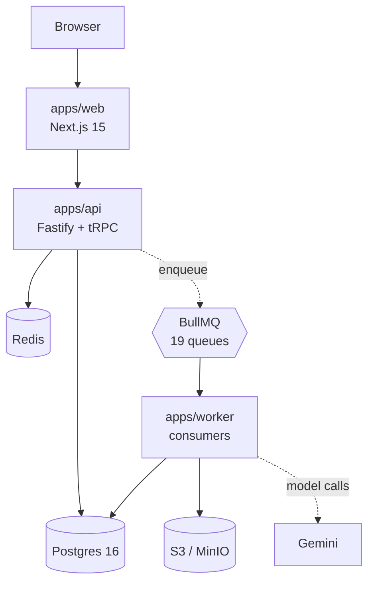
```mermaid
flowchart TB
  B["Browser"] --> W["apps/web<br/>Next.js 15"]
  W --> A["apps/api<br/>Fastify + tRPC"]
  A --> PG[("Postgres 16")]
  A --> RD[("Redis")]
  A -.enqueue.-> Q{{"BullMQ<br/>19 queues"}}
  Q --> WK["apps/worker<br/>consumers"]
  WK --> PG
  WK --> S3[("S3 / MinIO")]
  WK -.->|"model calls"| G["Gemini"]
```

Not microservices: receiving goods atomically touches lots, movements, the stock projection and the
event outbox. As separate services that becomes a distributed saga with compensating actions, for a
workload with no independent scaling need. The split is by **resource profile** — OCR is bursty and
external-bound, so it lives in the worker.

### 3 · Package layering

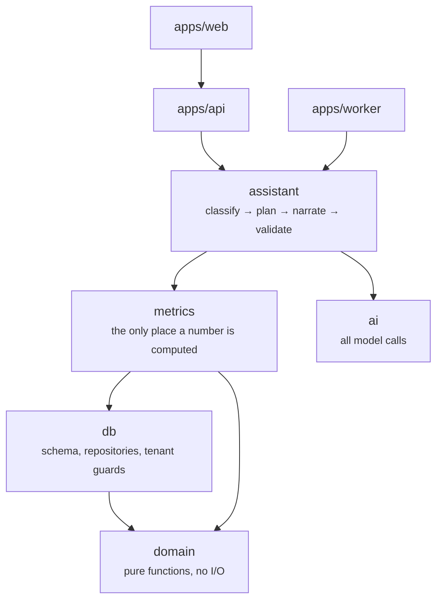
```mermaid
flowchart TB
  WEB["apps/web"] --> API["apps/api"]
  API --> ASST["assistant<br/><small>classify → plan → narrate → validate</small>"]
  WKR["apps/worker"] --> ASST
  ASST --> MET["metrics<br/><small>the only place a number is computed</small>"]
  ASST --> AI["ai<br/><small>all model calls</small>"]
  MET --> DB["db<br/><small>schema, repositories, tenant guards</small>"]
  DB --> DOM["domain<br/><small>pure functions, no I/O</small>"]
  MET --> DOM
```

Supporting packages — `authz`, `session`, `queue`, `storage`, `email`, `pos`, `integrations`,
`config`, `logger`, `ui` — sit beside these and are omitted here for legibility.

Boundaries are enforced in CI by **dependency-cruiser**, so the layering cannot quietly erode.
`packages/domain` has no I/O at all — which is what makes property-based testing viable.

### 4 · Where AI is allowed, and where it is not

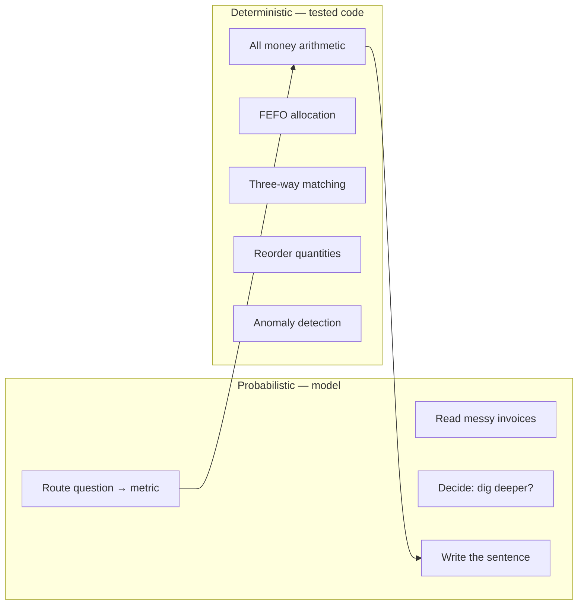
```mermaid
flowchart LR
  subgraph P["Probabilistic — model"]
    P1["Read messy invoices"]
    P2["Route question → metric"]
    P3["Decide: dig deeper?"]
    P4["Write the sentence"]
  end
  subgraph D["Deterministic — tested code"]
    D1["All money arithmetic"]
    D2["FEFO allocation"]
    D3["Three-way matching"]
    D4["Reorder quantities"]
    D5["Anomaly detection"]
  end
  P2 --> D1
  D1 --> P4
```

**The rule:** if a wrong answer costs money or corrupts data, it is deterministic. The model reads,
routes, and explains. It never calculates, and it has no write tools.

### 5 · How a question becomes a grounded answer

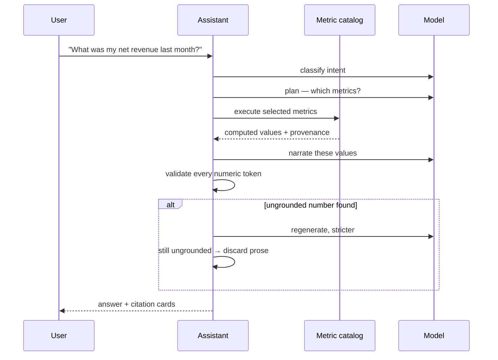
```mermaid
sequenceDiagram
  participant U as User
  participant A as Assistant
  participant M as Metric catalog
  participant L as Model
  U->>A: "What was my net revenue last month?"
  A->>L: classify intent
  A->>L: plan — which metrics?
  A->>M: execute selected metrics
  M-->>A: computed values + provenance
  A->>L: narrate these values
  A->>A: validate every numeric token
  alt ungrounded number found
    A->>L: regenerate, stricter
    A->>A: still ungrounded → discard prose
  end
  A-->>U: answer + citation cards
```

### 6 · The bounded investigation loop (EPIC-015)

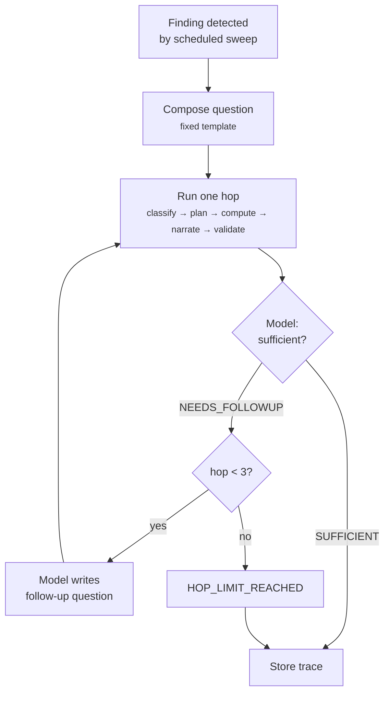
```mermaid
flowchart TB
  F["Finding detected<br/>by scheduled sweep"] --> Q["Compose question<br/><small>fixed template</small>"]
  Q --> H["Run one hop<br/><small>classify → plan → compute → narrate → validate</small>"]
  H --> S{"Model:<br/>sufficient?"}
  S -->|SUFFICIENT| DONE["Store trace"]
  S -->|"NEEDS_FOLLOWUP"| C{"hop &lt; 3?"}
  C -->|yes| FQ["Model writes<br/>follow-up question"]
  FQ --> H
  C -->|no| HL["HOP_LIMIT_REACHED"]
  HL --> DONE
```

Only the previous hops' **validated narration** is fed forward — never raw numbers. A bad inference
cannot compound. `MAX_HOPS = 3` is a hard cap, not a suggestion.

### 7 · AI drafts, humans approve

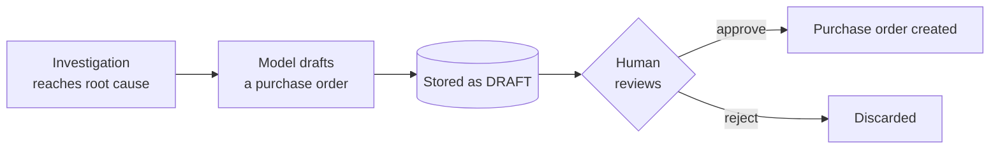
```mermaid
flowchart LR
  I["Investigation<br/>reaches root cause"] --> DR["Model drafts<br/>a purchase order"]
  DR --> DB[("Stored as DRAFT")]
  DB --> HU{"Human<br/>reviews"}
  HU -->|approve| PO["Purchase order created"]
  HU -->|reject| X["Discarded"]
```

Quantities and prices come from existing domain functions, never from the model. The approval is a
separate, explicit call — the assistant has no tool that can write business state.

### 8 · Tenant isolation at four layers

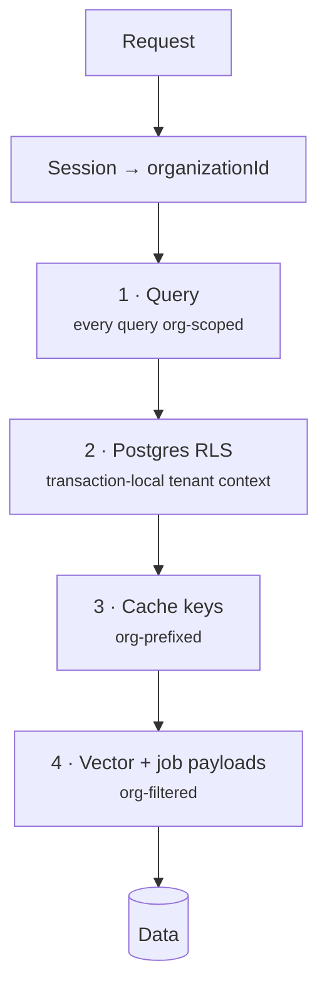
```mermaid
flowchart TB
  R["Request"] --> S["Session → organizationId"]
  S --> L1["1 · Query<br/><small>every query org-scoped</small>"]
  L1 --> L2["2 · Postgres RLS<br/><small>transaction-local tenant context</small>"]
  L2 --> L3["3 · Cache keys<br/><small>org-prefixed</small>"]
  L3 --> L4["4 · Vector + job payloads<br/><small>org-filtered</small>"]
  L4 --> D[("Data")]
```

A real cross-tenant endpoint attack suite runs in CI. Row-level security means a missing `WHERE`
clause fails closed at the database, not silently at the application.

### 9 · Invoice to inventory

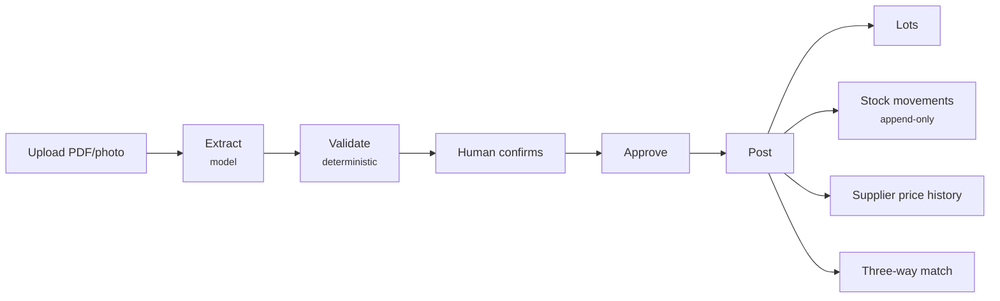
```mermaid
flowchart LR
  U["Upload PDF/photo"] --> EX["Extract<br/><small>model</small>"]
  EX --> V["Validate<br/><small>deterministic</small>"]
  V --> C["Human confirms"]
  C --> AP["Approve"]
  AP --> POST["Post"]
  POST --> LOT["Lots"]
  POST --> MOV["Stock movements<br/><small>append-only</small>"]
  POST --> PRICE["Supplier price history"]
  POST --> M3["Three-way match"]
```

### 10 · The append-only ledger

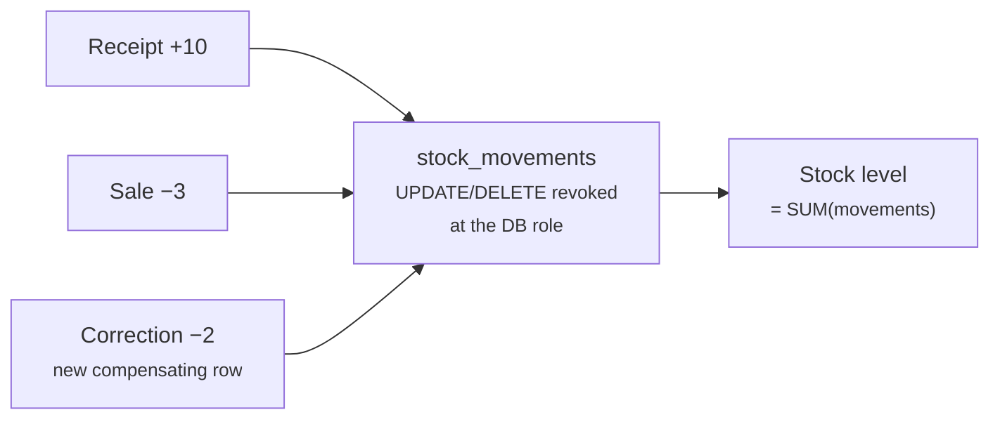
```mermaid
flowchart LR
  A["Receipt +10"] --> L["stock_movements<br/><small>UPDATE/DELETE revoked<br/>at the DB role</small>"]
  B["Sale −3"] --> L
  C["Correction −2<br/><small>new compensating row</small>"] --> L
  L --> P["Stock level<br/><small>= SUM(movements)</small>"]
```

Stock is never a stored counter that can drift. It is a projection of the ledger, so any historical
figure is reproducible. Corrections are new rows, never edits — which is what makes an audit
possible.

---

## The design principle everything follows

> **Missing data degrades to "unknown" — never to zero, never to a guess.**

A missing ingredient price becoming `0` doesn't look like a bug. It looks like excellent margin. The
report is confident, precise, and wrong — and nothing appears broken, so nobody investigates.

This single rule shapes the schema, the metric catalog, the API contract, and the UI. Nine
invariants enforce it mechanically in CI (`pnpm invariants`), because these violations look like
completely reasonable code in review:

| # | Invariant |
|---|---|
| I1 | LLMs never compute a business number |
| I2 | Every business number comes from a registered metric function |
| I3 | `stock_movements` is append-only |
| I4 | Every tenant-scoped query is org-scoped at four layers |
| I5 | Money and quantity are decimal branded types, never `number` |
| I6 | Unit conversion is explicit, applied once, at a boundary |
| I7 | Missing data degrades to unknown |
| I8 | State change and event emission share one transaction |
| I9 | AI drafts; humans approve. AI has no write tools |

Full reasoning: **[ARCHITECTURE.md](ARCHITECTURE.md)**.

---

## Troubleshooting

<details open>
<summary><b>Common issues</b></summary>

**`pnpm demo:quick` fails with a connection error**
Docker isn't up yet. Run `docker ps` — you should see `postgres`, `redis` and `minio` healthy. Give
Postgres ~10 seconds after `docker compose up -d`.

**Redis connection refused**
This project maps Redis to host port **16379**, not 6379 (Windows dynamic-port-range collision).
Check `REDIS_URL` in `.env.local` matches `docker-compose.yml`.

**Port 3000 or 3001 already in use**
Another dev server is running. Stop it — a stray worker will also steal background jobs.

**Screens load but every number is empty**
The seed didn't complete. Re-run `pnpm demo:quick` and watch for the final engagement step.

**Assistant answers "unavailable"**
No `GEMINI_API_KEY` in `.env.local`. Expected — the app degrades explicitly rather than inventing
figures. Everything else stays fully usable.

**`Cost variance: Not known`**
Working as designed. One ingredient is deliberately unpriced. See
[the design principle](#the-design-principle-everything-follows).

**Investigations show "No Gemini API key configured on this worker"**
The worker started without the key loaded. Stop `pnpm dev`, confirm the key is in `.env.local`, and
restart — scripts load it via `packages/config`.

</details>

### Verify your install

```bash
pnpm typecheck && pnpm lint && pnpm boundaries && pnpm test
```

All four must pass. `pnpm invariants` additionally machine-checks I1–I9 across the repo.

---

## Architecture

Full walkthrough: **[ARCHITECTURE.md](ARCHITECTURE.md)** — the invariants, the tenancy model, the
deterministic/probabilistic boundary, and how the assistant is kept from inventing numbers.

```
apps/web         Next.js 15 App Router
apps/api         Fastify — tRPC
apps/worker      Background consumers — 19 queues

packages/domain  Pure business logic, no I/O — costing, FEFO, recipe explosion
packages/db      Schema, migrations, repositories, tenant guards
packages/metrics The metric catalog — the only place a business number is computed, 67 functions
packages/ai      All model calls — extraction, classification, embeddings, prompt safety
packages/assistant The grounded answering pipeline — classify, plan, retrieve, narrate, validate
packages/pos     POS vendor adapters and the canonical sales model
packages/integrations  Vendor sync jobs kept off the request path
packages/authz   Permission model
packages/session Redis-backed sessions
packages/storage S3-compatible object storage
packages/email   Outbound mail (mocked transport) and inbound invoice intake
packages/queue   Background job queue (BullMQ)
packages/logger  Structured logging
packages/config  Environment loading
packages/ui      Shared components
```

**Postgres 16** (pgvector, pg_trgm, btree_gist) · **Redis** · **S3/MinIO** · TypeScript strict
throughout.

---

## Decisions worth explaining

**Money is a branded decimal type, never `number`.** Float arithmetic on money loses precision
silently — the error is invisible until it isn't. Quantities carry their unit in the type, making
a unit mismatch a compile error rather than a value that's wrong by a factor of 1000.

**The ledger is append-only, enforced by the database.** Not by convention or an ORM hook — the
application role has `UPDATE` and `DELETE` revoked on the movements table. A correction is a new
row. This is what makes historical numbers reproducible.

**Times are `TIMESTAMPTZ`, stored UTC, presented in store timezone.** A restaurant's "yesterday" is
a local-time concept; dayparts computed in UTC are simply wrong. Movements are bi-temporal —
`occurred_at` (business time) versus `recorded_at` (system time) — so a Monday delivery entered on
Wednesday belongs in Monday's history.

**Contribution margin, never "profit".** Rent, labour and tax are outside the data boundary, so the
number is labelled for what it actually is.

---

## Testing

Financial and inventory calculations get property-based tests asserting invariants rather than
examples — stock never diverges from the ledger sum, recipe explosion conserves quantity, FEFO
never over-allocates a lot, margin components sum exactly to the total. These are the calculations
where a subtle bug produces wrong numbers for months, and example-based tests miss precisely the
edge cases that matter.

Integration tests run against real Postgres and real Redis, never mocks: row-level security proves
nothing against a fake database. Database constraints are verified directly — both the rejection
and the adjacent accepted case — before any code depends on them.

The assistant carries its own golden evaluation set — metric-routing, honest-refusal, and
prompt-injection cases that run through the real pipeline against the live model
(`pnpm --filter @retailos/api eval`), because injection resistance is a claim about a model, not
about code, and only a real run says anything about it at all.

Its pass rate is **not yet a quality metric, and is not quoted as one.** The runner does not
distinguish a network failure from a real one, so a transient `fetch failed` is scored identically
to a wrong answer. Model sampling was also unpinned until recently, which made scores move between
runs with no code change. Temperature is now fixed at zero; separating infrastructure failure from
logic failure is the remaining work before any number here means something.

---

## Running it in detail

Start all three processes together:

```bash
pnpm dev
```

Or run them separately when debugging:

```bash
pnpm --filter @retailos/api dev       # :3001
pnpm --filter @retailos/web dev       # :3000
pnpm --filter @retailos/worker dev    # extraction, embeddings, notifications
```

The worker is not optional for the full experience — document extraction, embeddings and
notification delivery are all driven by it.

Scripts load `.env.local` themselves (`packages/config`), so no manual `export` step is needed. Real
environment variables always take precedence, which is why CI — which sets them explicitly and ships
no `.env.local` — is unaffected.

### Demo data

The repository contains a **generator**, not a dataset. `mock-data/generate/` is committed; the
corpus it produces is gitignored, so a fresh clone reproduces it rather than downloading it.

`pnpm demo` runs all of it. The individual steps, if you need them separately:

```bash
pnpm --filter @retailos/api exec tsx ../../mock-data/generate/generate.mts   # write the corpus
pnpm --filter @retailos/api exec tsx src/scripts/seed-demo.mts               # catalog + sales
pnpm --filter @retailos/api exec tsx src/scripts/seed-demo-invoices.mts      # GST invoices
pnpm --filter @retailos/api exec tsx src/scripts/seed-demo-operations.mts    # POs, receipts, waste
pnpm --filter @retailos/api exec tsx src/scripts/seed-demo-engagement.mts    # alerts, history
```

Run them in the order listed: each builds on the one before, and `seed-demo.mts` wipes the demo org
before rebuilding it. Stop the worker before `seed-demo-invoices.mts` — it will otherwise pick up
the extraction jobs and re-extract over the seeded rows.

**Do not regenerate the corpus against a database already seeded from it.** Generated dates anchor
to generation time, so a regenerated corpus describes a different dataset than the one already in
the database, and the two can only be reconciled by re-running the whole seed.

A three-outlet Bengaluru café chain: 180 days of history, ~50k sales transactions, ~455k stock
movements, 75 GST tax invoices with real GSTIN/HSN/CGST-SGST across four distinct supplier layouts.

Three properties make it worth more than a fixture:

**It is deterministic.** Every draw comes from a seeded PRNG, and each store-day derives its own
stream from `(seed, store, date)` rather than sharing one sequential generator — so a day's data is
a pure function of its own key, independent of how many days were generated before it. Two runs
produce byte-identical output.

**Nothing is inserted directly.** Every row is written through the same repositories and services
the application uses: sales run recipe explosion → FEFO draw → movement posting; invoices go
through the real upload → confirm → approve pipeline; notifications come from calling the actual
rule engine and only firing where it returns `fires: true` (114 stock candidates evaluated, 2
fired). Stock levels are a genuine projection of the ledger — verified, not asserted.

**It contains deliberate imperfection.** One ingredient is left permanently unpriced, so a real menu
item reports **unknown** cost on screen and period-wide theoretical COGS honestly cannot be
computed. A supplier's on-time rate degrades from 100% to 57% across the window. Prices creep 13% on
one supplier's staples. A demo where every figure resolves proves nothing about the one rule this
system is built around.

`mock-data/findings/` documents each planted narrative with the figure it should produce, measured
from the generated corpus rather than hand-written.

---

## Scope boundaries

Deliberately **not** built: payment processing (PCI scope), general ledger, payroll, or tax
(regulated), autonomous supplier contact (liability), and machine learning wherever a deterministic
formula is correct and explainable.

"Profit" is never reported — rent, labour, and tax are outside the system's data boundary. The
number is **contribution margin**, and it's labelled as such.

The demo corpus is **synthetic and deterministic**. It demonstrates seeded failure modes, not
measured customer outcomes. The repository has not been load-tested. Outbound email is recorded but
not sent.

---

## Roadmap

Not yet built: multi-organization login (an accountant with several clients gets an explicit
"not yet supported" error rather than a silently-picked tenant), per-channel notification retry and
dead-lettering, and a public REST API for integrations.

Deliberately deferred rather than missing: **email delivery is recorded but not sent** — a
notification fans out to real per-recipient, per-channel delivery rows, and the in-app channel is
marked delivered while email stays `PENDING`, because claiming a send that never happened is the
same class of lie as a fabricated number.

---

## License

MIT — see [LICENSE](LICENSE).
